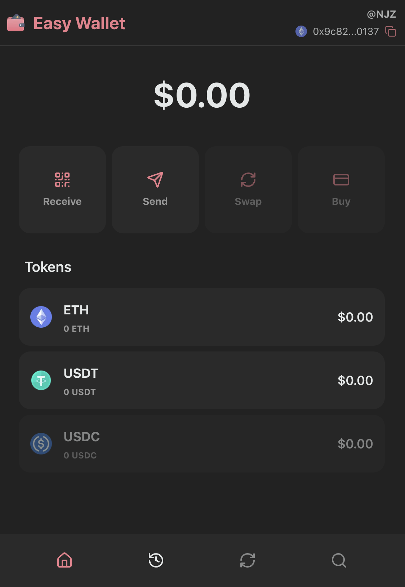

<!-- PROJECT LOGO -->
 

  

  <h3 align="center">Easy Wallet</h3>

  

    This is a demo application for a web3 wallet.

## Tech Stack

[![NextJs][nextjs-shield]][ref-nextjs]
[![Typescript][typescript-shield]][ref-typescript]
[![TailwindCSS][tailwindcss-shield]][ref-tailwindcss]
[![Shadcn][shadcn-shield]][ref-shadcn]

## Demo

The demo of this application can be found [here](https://easy-wallet-six.vercel.app/createWallet).

<!-- BADGE LINKS -->

[nextjs-shield]: https://img.shields.io/badge/next.js-000000?style=for-the-badge&logo=nextdotjs&logoColor=white
[typescript-shield]: https://img.shields.io/badge/TypeScript-007ACC?style=for-the-badge&logo=typescript&logoColor=white
[tailwindcss-shield]: https://img.shields.io/badge/Tailwind_CSS-grey?style=for-the-badge&logo=tailwind-css&logoColor=38B2AC
[shadcn-shield]: https://img.shields.io/badge/shadcn/ui-000000?style=for-the-badge&logo=shadcn/ui&logoColor=white

<!-- Reference -->
[ref-nextjs]: https://nextjs.org/
[ref-typescript]: https://www.typescriptlang.org/
[ref-tailwindcss]: https://tailwindcss.com/
[ref-shadcn]: https://ui.shadcn.com/